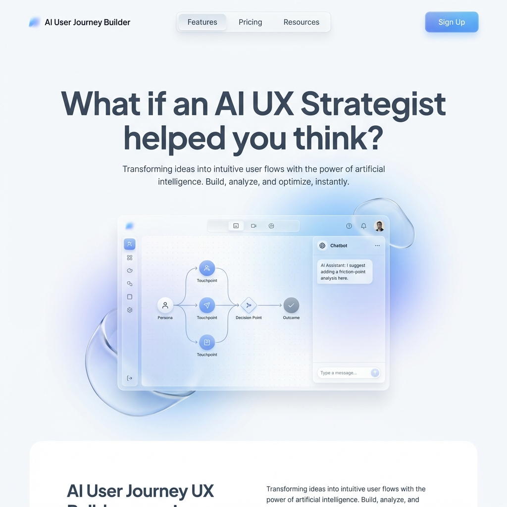
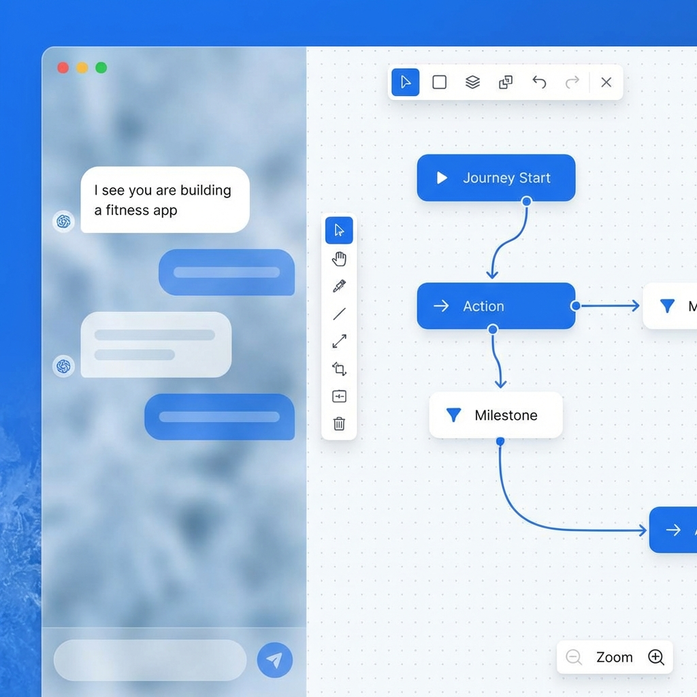
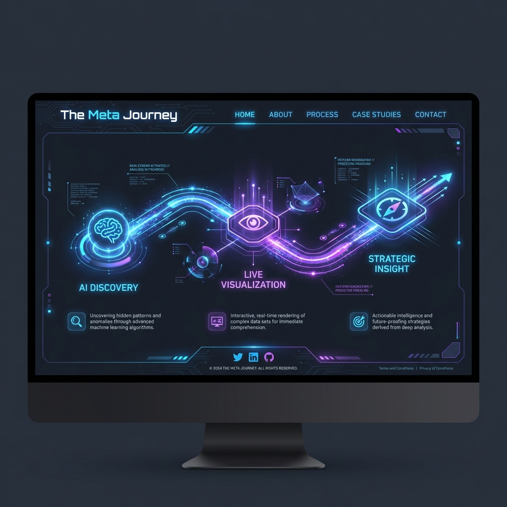

# 🚀 AI User Journey Builder - Walkthrough & Visual Guide

Welcome to the newly upgraded **Meta Journey Experience**. This document highlights the key features, UI improvements, and the AI-powered capabilities now available in the application.

---

## 1. The New Vision: AI UX Strategist

We have shifted from a simple diagram tool to a strategic partner. The new landing page reflects this "Agentic" approach.

### Key Features:
- **Value-First Messaging**: "What if an AI UX Strategist helped you think?"
- **Clean Aesthetic**: Modern slate/white palette with minimal distractions.
- **Glassmorphism**: Subtle transparency effects to feel premium and modern.

---

## 2. The Magical Experience: Live Journey Building

This is the core of the application. As you chat with the AI, the user journey map is constructed in real-time on the right side of the screen.

### How It Works:
1.  **Split Screen Layout**: Chat on the left, Canvas on the right.
2.  **Contextual AI (Claude 3 Haiku)**: The AI understands *intent*, not just keywords. If you say "I want to build a fitness app for seniors," it implies "Accessibility" and "Motivation" nodes automatically.
3.  **Real-Time Visualization**: Nodes appear instantly (<1s latency) as you type.
4.  **Glass UI**: The chat interface floats over the canvas with a blur effect, maintaining context.

---

## 3. The "Meta Journey" & Dark Mode

For the `/demo` page, we introduced a high-contrast Dark Mode to showcase the underlying process.

### The Process:
1.  **AI Discovery**: The system interviews the user to extract hidden requirements.
2.  **Live Visualization**: Data is transformed into ReactFlow nodes instantly.
3.  **Strategic Insight**: The final graph serves as a blueprint for product development.

---

## 4. Technical Upgrades

To support this experience, we made significant under-the-hood improvements:

*   **⚡ Speed Upgrade**: Switched to **Claude 3 Haiku** for sub-second response times.
*   **🛡️ Robustness**: Implemented a hybrid engine (AI + Heuristic Fallback) to ensure the app *never* breaks.
*   **🔧 Fixes**: Resolved the "Stuck Spinner" issue by auto-seeding the database and fixing the infinite redirect loop.

### Try It Now
The application is running live at:
**[http://localhost:3005](http://localhost:3005)**
