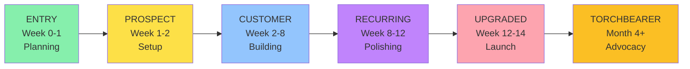
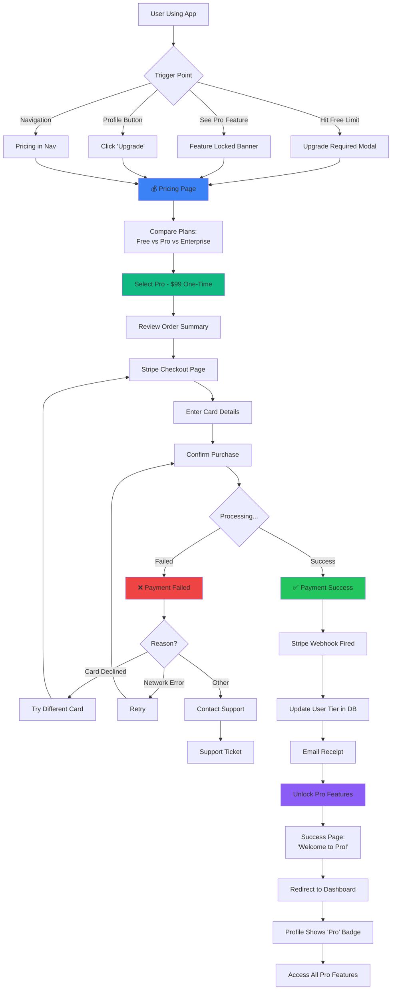

# User Journey: Building the User Journey Builder Platform

> Meta-journey: Using our own concept to plan building the platform itself

---

## 🎯 User Profile: You (The Builder)

**Goal**: Build an AI-powered User Journey Mapping platform that helps users visualize their product's user flows  
**Experience Level**: Developer with AI/full-stack knowledge  
**Timeline**: 12-14 weeks to MVP  
**Monetization**: SaaS with "hire expert" interventions  

**Development Approach**: Building 100% from scratch. Studied ReactFlow documentation and various open-source examples (including NodeBase) to understand node-based editor patterns. Not using any existing codebase - creating our own original architecture with the best technology choices for our specific needs.

---

## 📊 Complete User Journey (Mermaid Diagram)

```mermaid
graph TD
    Start([Project Kickoff]) --> Planning[Read Implementation Docs]
    Planning --> StudyInspiration[Study ReactFlow Patterns]
    
    StudyInspiration --> Setup[Initialize Next.js Project]
    Setup --> CommonSetup[Setup Database & Auth]
    
    CommonSetup --> CreateProfile[Create User Profile]
    CreateProfile --> ProfileSetup[Setup Profile Page]
    ProfileSetup --> Phase1[Build Interview System]
    
    Phase1 --> Check1{Working?}
    Check1 -->|No| Debug1[Debug & Fix]
    Debug1 --> Phase1
    Check1 -->|Yes| Phase2[Build AI Integration]
    
    Phase2 --> Decision2{AI Working Well?}
    Decision2 -->|No| TunePrompts[Tune Prompts]
    TunePrompts --> Phase2
    Decision2 -->|Yes| Phase3[Build Visual Editor]
    
    Phase3 --> Phase4[Create Node Types]
    Phase4 --> Milestone1[🎉 MVP Core Complete]
    
    Milestone1 --> Decision3{Need Help?}
    Decision3 -->|Yes| Intervention1[💡 Hire Expert / Get Review]
    Decision3 -->|No| Phase5[Add Comment System]
    
    Intervention1 -->|View Pricing| PricingPage[💰 Pricing Page]
    PricingPage --> SelectPlan[Select One-Time Plan]
    SelectPlan --> Checkout[Stripe Checkout]
    Checkout --> PaymentSuccess{Payment Success?}
    PaymentSuccess -->|Yes| ReceiptEmail[Send Receipt Email]
    PaymentSuccess -->|No| PaymentFailed[Payment Failed]
    PaymentFailed --> Checkout
    ReceiptEmail --> UpdateProfile[Update Profile: Pro Access]
    UpdateProfile --> ExpertHelp[Expert Consultation]
    
    Intervention1 -->|Skip| Phase5
    ExpertHelp --> Phase5
    
    Phase5 --> Phase6[Build Export Features]
    Phase6 --> Phase7[Add Analytics]
    Phase7 --> Phase8[Polish & Test]
    
    Phase8 --> Decision4{Quality Check?}
    Decision4 -->|Issues Found| Fix[Fix Issues]
    Fix --> Phase8
    Decision4 -->|Ready| Deploy[Deploy to Vercel]
    
    Deploy --> SoftLaunch[Beta Launch]
    SoftLaunch --> Feedback{Good Feedback?}
    
    Feedback -->|Issues| Iterate[Iterate & Improve]
    Iterate --> SoftLaunch
    Feedback -->|Positive| PublicLaunch[🚀 Public Launch]
    
    PublicLaunch --> UserOnboard[New User Onboarding]
    UserOnboard --> UserProfile[User Creates Profile]
    UserProfile --> FreeTier[Start with Free Tier]
    
    FreeTier --> UseApp[Use Platform]
    UseApp --> HitLimit{Hit Free Limit?}
    
    HitLimit -->|Yes| UpgradePrompt[Upgrade Prompt]
    HitLimit -->|No| UseApp
    
    UpgradePrompt --> ViewPricing[View Pricing Page]
    ViewPricing --> PurchaseDecision{Purchase?}
    
    PurchaseDecision -->|Yes| OneTimePurchase[💳 One-Time Purchase $99]
    PurchaseDecision -->|Maybe Later| ContinueFree[Continue Free]
    
    OneTimePurchase --> StripeCheckout[Stripe Payment]
    StripeCheckout --> PaymentComplete{Success?}
    PaymentComplete -->|Yes| UnlockPro[Unlock Pro Features]
    PaymentComplete -->|No| RetryPayment[Retry]
    RetryPayment --> StripeCheckout
    
    UnlockPro --> ProfileUpdated[Profile: Pro User]
    ProfileUpdated --> ProFeatures[Access All Features]
    
    ContinueFree --> UseApp
    ProFeatures --> Growth
    
    Growth --> Decision5{Scale Needed?}
    
    Decision5 -->|Yes| Intervention2[💡 Hire Growth Expert]
    Decision5 -->|No| Maintain[Maintain & Add Features]
    
    Intervention2 -->|Accept| GrowthPurchase[💳 Growth Package $5K]
    Intervention2 -->|Skip| Maintain
    GrowthPurchase --> GrowthHelp[Growth Consultation]
    GrowthHelp --> Scale[Scale Infrastructure]
    
    Maintain --> Recurring[Recurring Customer Phase]
    Scale --> Recurring
    
    Recurring --> Premium{Upgrade?}
    Premium -->|Yes| Upgraded[Premium Features]
    Premium -->|No| Continue[Continue Free/Basic]
    
    Upgraded --> Advocate[Become Torchbearer]
    Continue --> Advocate
    
    Advocate --> End([Successful Platform])
    
    %% Profile Access Points
    UseApp -.View Profile.-> UserDashboard[📊 User Dashboard]
    UserDashboard -.->|Edit| UserProfile
    UserDashboard -.View Purchases.-> PurchaseHistory[Purchase History]
    PurchaseHistory -.-> ProfileUpdated
    
    style Start fill:#4ade80
    style Milestone1 fill:#fbbf24
    style PublicLaunch fill:#f87171
    style End fill:#818cf8
    style Intervention1 fill:#fb923c
    style Intervention2 fill:#fb923c
    style Decision3 fill:#fde047
    style Decision5 fill:#fde047
    style PricingPage fill:#3b82f6
    style OneTimePurchase fill:#10b981
    style GrowthPurchase fill:#10b981
    style UserProfile fill:#8b5cf6
    style ProfileUpdated fill:#8b5cf6
    style UserDashboard fill:#8b5cf6
```



---

## 🚶 Detailed Journey Phases

### **Phase 0: USER PROFILE SETUP** 👤
**Touchpoint**: Account creation and profile configuration  
**Actions**:
- ✅ User signs up (email + password OR OAuth)
- ✅ Create user profile in database
- ✅ Profile page created with sections:
  - Personal info (name, email, avatar)
  - Account tier (Free/Pro)
  - Usage statistics (journeys created, exports)
  - Purchase history
  - Billing information
  - API keys (if applicable)
- ✅ Set default preferences

**Profile Route**: `/profile` or `/dashboard/profile`

**Lifecycle Stage**: ENTRY  
**Status**: 🔄 SETUP REQUIRED

**Database Schema Addition**:
```prisma
model UserProfile {
  id              String   @id @default(cuid())
  userId          String   @unique
  user            User     @relation(fields: [userId], references: [id])
  
  // Profile Info
  displayName     String?
  bio             String?
  avatar          String?
  company         String?
  website         String?
  
  // Account Status
  tier            UserTier @default(FREE)
  tierExpiry      DateTime?
  
  // Usage Tracking
  journeysCreated Int      @default(0)
  exportsCount    Int      @default(0)
  storageUsed     Int      @default(0) // MB
  
  // Preferences
  emailNotifications Boolean @default(true)
  theme           String   @default("light")
  
  createdAt       DateTime @default(now())
  updatedAt       DateTime @updatedAt
}

enum UserTier {
  FREE          // 5 journeys, basic export
  PRO           // Unlimited, all features
  ENTERPRISE    // Custom limits
}

model Purchase {
  id          String   @id @default(cuid())
  userId      String
  user        User     @relation(fields: [userId], references: [id])
  
  // Purchase Details
  type        PurchaseType
  amount      Float
  currency    String   @default("USD")
  
  // Stripe Info
  stripePaymentId String?
  status      PaymentStatus
  
  // What was purchased
  productName String
  features    Json?
  
  // Receipt
  receiptUrl  String?
  invoiceUrl  String?
  
  createdAt   DateTime @default(now())
  
  @@index([userId])
}

enum PurchaseType {
  ONE_TIME
  SUBSCRIPTION
  CONSULTATION
}

enum PaymentStatus {
  PENDING
  COMPLETED
  FAILED
  REFUNDED
}
```

---

### **Phase 1: ENTRY** 🚪
**Touchpoint**: Project discovery and planning  
**Actions**:
- ✅ Researched ReactFlow (docs + open-source examples)
- ✅ Analyzed various node-based editors for patterns
- ✅ Created comprehensive implementation.md
- ✅ Created detailed tasklist.md  
- ✅ Set up project folder structure
- ✅ Created project journey map (meta!)

**Key Insight**: Studied ReactFlow documentation and multiple examples (NodeBase being one) to understand node-based UI patterns. Now building our own original system optimized for user journey mapping.

**Lifecycle Stage**: ENTRY  
**Status**: ✅ COMPLETED

---

### **Phase 2: PROSPECT** 🔍
**Touchpoint**: Technology evaluation and setup  
**Actions**:
- [ ] Finalize technology stack (best tools for our needs)
- [ ] Set up Next.js 14 project from scratch
- [ ] Configure PostgreSQL database
- [ ] Set up Prisma ORM
- [ ] Configure authentication (evaluate Better Auth vs alternatives)
- [ ] Set up tRPC routers (or evaluate alternatives)

**Lifecycle Stage**: PROSPECT  
**Decision Point**: 
- If confident → Continue solo
- If uncertain → Consider hiring consultant

**Estimated Time**: 3 days  
**Status**: ⏳ PENDING

---

### **Phase 3: EARLY CUSTOMER** 👷
**Touchpoint**: Building core features  
**Actions**:
- [ ] Build interview wizard UI
- [ ] Integrate OpenAI/Claude API
- [ ] Create journey generation logic
- [ ] Build ReactFlow editor
- [ ] Create 5-8 basic node types
- [ ] Test end-to-end flow

**Lifecycle Stage**: CUSTOMER (committed to building)  
**Milestone**: First working journey generated by AI

**Estimated Time**: 5-6 weeks  
**Status**: ⏳ PENDING

---

### **Phase 4: INTERVENTION POINT** 💡
**Touchpoint**: Critical decision - need expert help?  
**Trigger**: Struggling with AI integration, complex UI, or architecture

**Options**:
1. **Accept Help** → Hire expert for:
   - AI prompt engineering ($1,500)
   - ReactFlow optimization ($2,000)
   - Full-stack architecture review ($2,500)
   - **Total Quote**: $3,000-6,000

2. **Skip** → Continue with community support (Discord, GitHub)

**Decision Factors**:
- Budget available?
- Timeline pressure?
- Confidence level?
- Complexity of issues?

---

### **Phase 5: ACTIVE DEVELOPMENT** 🔨
**Touchpoint**: Feature completion  
**Actions**:
- [ ] Add commenting system
- [ ] Build version control
- [ ] Create export functionality (Mermaid, PNG)
- [ ] Add analytics dashboard
- [ ] Build quote generator
- [ ] Polish UI/UX
- [ ] Write tests

**Lifecycle Stage**: RECURRING CUSTOMER (consistent progress)  
**Estimated Time**: 3-4 weeks  
**Status**: ⏳ PENDING

---

### **Phase 6: CONVERSION** 💰
**Touchpoint**: First deployment and beta users  
**Actions**:
- [ ] Deploy to Vercel
- [ ] Set up production database (Neon)
- [ ] Configure domain and SSL
- [ ] Invite 10-20 beta testers
- [ ] Collect feedback
- [ ] Fix critical bugs

**Lifecycle Stage**: CUSTOMER (first "sale" = successful deployment)  
**Milestone**: Platform live with real users

**Estimated Time**: 1 week  
**Status**: ⏳ PENDING

---

### **Phase 7: GROWTH** 📈
**Touchpoint**: Public launch and marketing  
**Actions**:
- [ ] Public launch on Product Hunt
- [ ] Share on Twitter, LinkedIn, Reddit
- [ ] Write launch blog post
- [ ] Create demo video
- [ ] Set up analytics (PostHog)
- [ ] Monitor user behavior

**Lifecycle Stage**: UPGRADED (scaling up)

---

### **Phase 8: INTERVENTION POINT 2** 💡
**Touchpoint**: Growth decision - scale alone or get help?  
**Trigger**: Good traction but need to scale

**Options**:
1. **Accept Help** → Hire growth expert for:
   - Marketing strategy ($3,000)
   - SEO optimization ($2,000)
   - Paid ads management ($5,000+)

2. **Skip** → Organic growth only

---

### **Phase 9: TORCHBEARER** 🏆
**Touchpoint**: Platform success and advocacy  
**Actions**:
- Share case studies
- Build community
- Create content (blog, YouTube)
- Help other builders
- Open source parts of the code
- Speak at conferences

**Lifecycle Stage**: TORCHBEARER (advocate and leader)

---

## 🎯 Critical Decision Points

### Decision 1: Tech Stack (Week 0)
```
Question: What technologies to use?

Recommendation: Next.js 14 + ReactFlow + PostgreSQL

Core Stack:
  - Next.js 14 (App Router) - Modern React framework
  - ReactFlow - Visual node-based editor (learned from NodeBase)
  - PostgreSQL + Prisma - Database
  - tRPC - Type-safe APIs
  - OpenAI/Claude - AI journey generation
  - Tailwind + shadcn/ui - Styling

Why this stack:
  ✅ ReactFlow handles all the visual editor complexity
  ✅ Next.js gives us full-stack in one framework
  ✅ Prisma makes database work elegant
  ✅ All TypeScript = type safety everywhere
  ✅ Can deploy to Vercel in minutes
```

### Decision 2: AI Provider (Week 2)
```
Question: OpenAI or Anthropic?

Option A: OpenAI GPT-4
  Cost: $0.01/1K tokens input, $0.03/1K tokens output
  Pros: Best for structured output, function calling
  Cons: More expensive
  
Option B: Anthropic Claude 3
  Cost: $0.003/1K tokens input, $0.015/1K tokens output
  Pros: Cheaper, better at long context
  Cons: Newer API
  
Recommendation: START WITH OPENAI
  - Better JSON mode
  - More examples available
  - Can switch later
```

### Decision 3: Need Expert Help? (Week 6)
```
Question: Stuck on complex features?

Indicators you need help:
  - AI prompts not generating good journeys
  - ReactFlow performance issues
  - Database queries slow
  - Authentication bugs
  - Deployment problems

When to hire:
  ✅ Budget available ($3K-6K)
  ✅ Deadline pressure
  ✅ Issue blocking progress >3 days
  
When to skip:
  ✅ Issue is solvable with research
  ✅ Good community support available
  ✅ Not time-critical
```

---

## 📊 Lifecycle Stage Breakdown



---

## 🚀 Quick Action Plan

### Week 1: Foundation
- [x] Documentation complete
- [ ] Initialize Next.js project
- [ ] Set up database
- [ ] Configure auth

### Week 2-3: Interview System
- [ ] Build wizard UI
- [ ] OR build AI chat interface
- [ ] Test data collection

### Week 4-5: AI Generator
- [ ] Integrate OpenAI
- [ ] Test journey generation
- [ ] Tune prompts

### Week 6-7: Visual Editor
- [ ] Build ReactFlow editor from scratch
- [ ] Create custom node components
- [ ] Implement connection logic
- [ ] Test editing

### Week 8-9: Advanced Features
- [ ] Comments system
- [ ] Version control
- [ ] Export features

### Week 10-11: Polish
- [ ] UI/UX improvements
- [ ] Testing
- [ ] Documentation

### Week 12: Deploy
- [ ] Production deployment
- [ ] Beta launch

### Week 13-14: Public Launch
- [ ] Marketing
- [ ] Public release
- [ ] Monitor feedback

---

## � One-Time Purchase Flow (Detailed)

### **Path to Purchase** 🛒



---

### **Pricing Page Details** 💰

**Route**: `/pricing`

**Plans**:

| Feature | Free | Pro (One-Time $99) | Enterprise |
|---------|------|-------------------|------------|
| Journeys | 5 | ∞ Unlimited | ∞ Unlimited |
| AI Generations | 10/month | Unlimited | Unlimited |
| Export Formats | Mermaid only | All formats | All + API |
| Comments | ❌ No | ✅ Yes | ✅ Yes |
| Version Control | ❌ No | ✅ Yes | ✅ Yes |
| Collaboration | ❌ No | 3 members | Unlimited |
| Priority Support | ❌ No | ✅ Email | ✅ Phone + Slack |
| Custom Branding | ❌ No | ❌ No | ✅ Yes |
| API Access | ❌ No | ✅ Yes | ✅ Yes |

**CTA Buttons**:
- Free: "Get Started"
- Pro: **"Buy Now - $99 One-Time"** ← Main conversion
- Enterprise: "Contact Sales"

---

### **Stripe Integration Flow** 🔐

```typescript
// src/app/api/stripe/checkout/route.ts

export async function POST(req: Request) {
  const { userId, plan } = await req.json();
  
  // Create Stripe checkout session
  const session = await stripe.checkout.sessions.create({
    customer_email: user.email,
    line_items: [
      {
        price_data: {
          currency: 'usd',
          product_data: {
            name: 'User Journey Builder Pro',
            description: 'Lifetime access to all Pro features',
            images: ['https://yoursite.com/pro-badge.png'],
          },
          unit_amount: 9900, // $99.00
        },
        quantity: 1,
      },
    ],
    mode: 'payment', // One-time payment
    success_url: `${process.env.NEXT_PUBLIC_URL}/purchase/success?session_id={CHECKOUT_SESSION_ID}`,
    cancel_url: `${process.env.NEXT_PUBLIC_URL}/pricing?canceled=true`,
    metadata: {
      userId: userId,
      plan: 'PRO',
    },
  });
  
  return Response.json({ url: session.url });
}
```

```typescript
// src/app/api/stripe/webhook/route.ts

export async function POST(req: Request) {
  const sig = req.headers.get('stripe-signature');
  const body = await req.text();
  
  let event;
  try {
    event = stripe.webhooks.constructEvent(body, sig, process.env.STRIPE_WEBHOOK_SECRET);
  } catch (err) {
    return Response.json({ error: 'Webhook signature verification failed' }, { status: 400 });
  }
  
  // Handle the event
  switch (event.type) {
    case 'checkout.session.completed':
      const session = event.data.object;
      
      // Upgrade user to Pro
      await db.user.update({
        where: { id: session.metadata.userId },
        data: { tier: 'PRO' },
      });
      
      // Create purchase record
      await db.purchase.create({
        data: {
          userId: session.metadata.userId,
          type: 'ONE_TIME',
          amount: session.amount_total / 100,
          currency: session.currency,
          status: 'COMPLETED',
          productName: 'Pro Plan',
          stripePaymentId: session.payment_intent,
        },
      });
      
      // Send receipt email
      await sendReceiptEmail(session);
      
      break;
      
    case 'payment_intent.payment_failed':
      // Handle failed payment
      await logPaymentFailure(event.data.object);
      break;
  }
  
  return Response.json({ received: true });
}
```

---

### **User Profile Page** 👤

**Route**: `/profile` or `/dashboard/profile`

**Sections**:

1. **Profile Header**
   - Avatar
   - Display name
   - User tier badge (Free/Pro/Enterprise)
   - "Edit Profile" button

2. **Account Information**
   - Email
   - Member since date
   - Account tier with benefits list
   - "Upgrade to Pro" button (if Free)

3. **Usage Statistics**
   - Journeys created: 3/5 (Free) or 47/∞ (Pro)
   - AI generations used this month: 8/10 (Free)
   - Storage used: 12 MB / 100 MB
   - Exports generated: 15

4. **Purchase History**
   - List of all purchases
   - Download receipts
   - View invoices

5. **Billing**
   - Payment methods (if saved)
   - Next billing date (if subscription)
   - "Update payment method"

6. **API Keys** (Pro only)
   - Generate API key
   - Copy to clipboard
   - Revoke access

7. **Preferences**
   - Email notifications toggle
   - Theme (light/dark)
   - Language

8. **Danger Zone**
   - Export all data
   - Delete account

---

### **Purchase Triggers** 🎯

**When to Show Upgrade Prompts**:

1. **Free Limit Reached**
   ```
   Modal: "You've reached your limit of 5 journeys"
   CTA: "Upgrade to Pro for unlimited journeys - $99"
   ```

2. **Pro Feature Locked**
   ```
   Banner: "🔒 Comments are a Pro feature"
   CTA: "Unlock for $99"
   ```

3. **Export Limitation**
   ```
   Toast: "PNG export is only available on Pro"
   CTA: "Upgrade Now"
   ```

4. **Profile View**
   ```
   Button in profile: "Upgrade to Pro"
   Shows benefits comparison
   ```

5. **After 3rd Journey**
   ```
   Gentle reminder: "You have 2 journeys left. Upgrade for unlimited!"
   ```

---

### **Post-Purchase Experience** 🎉

**Success Page** (`/purchase/success`):
```
🎉 Welcome to Pro!

Your account has been upgraded successfully.

What's New:
✅ Unlimited journeys
✅ All export formats
✅ Comments & collaboration
✅ Version control
✅ Priority support

[Go to Dashboard] [View Receipt]

Receipt sent to: user@email.com
```

**Email Receipt**:
```
Subject: Your User Journey Builder Pro Purchase

Hi [Name],

Thank you for purchasing User Journey Builder Pro!

Order Summary:
- Product: Pro Plan (Lifetime)
- Amount: $99.00 USD
- Date: Jan 30, 2026
- Payment Method: •••• 4242

Your Pro features are now active!

[View Receipt] [Access Dashboard]

Questions? Reply to this email.
```

**Profile Updated**:
- Pro badge visible
- Limits removed
- All features unlocked
- Purchase appears in history

---

## 🔗 Navigation to Profile & Purchase

### **Navigation Bar**
```
[Logo] [Journeys] [Pricing] [Docs] | [Profile ▾] [Notifications]
                                       ↓
                                    [My Profile]
                                    [Settings]
                                    [Upgrade to Pro] ← If Free
                                    [Purchase History]
                                    [Sign Out]
```

### **Dashboard Sidebar**
```
📊 Dashboard
📋 My Journeys
➕ Create New
💰 Pricing         ← Direct link
👤 Profile         ← Direct link
⚙️ Settings
```

### **Quick Access Points**

1. **From Anywhere**:
   - Click avatar → Profile dropdown → "My Profile"
   - Click avatar → "Upgrade to Pro" (if Free)

2. **From Dashboard**:
   - Profile icon in sidebar
   - Usage widget shows tier and upgrade button

3. **From Journey Editor**:
   - Top-right avatar
   - "Upgrade" banner (if hitting limits)

4. **From Pricing Page**:
   - Public route: `/pricing`
   - Accessible without login
   - After login, "Buy Now" redirects to checkout

---

### **Complete Purchase User Flow Example** 📝

**Scenario**: Free user hits limit

1. User creates their 5th journey
2. Modal appears: "You've reached your free limit"
3. Click "Upgrade to Pro"
4. Redirect to `/pricing`
5. Review plan comparison
6. Click "Buy Now - $99"
7. Redirect to Stripe Checkout
8. Enter card: 4242 4242 4242 4242
9. Click "Pay $99"
10. Stripe processes payment
11. Webhook fires → DB updated
12. Redirect to `/purchase/success`
13. See success message
14. Click "Go to Dashboard"
15. Profile now shows "Pro" badge
16. Can create unlimited journeys
17. Receipt email received
18. Purchase visible in Profile → Purchase History

**Total Time**: ~2 minutes from trigger to Pro access

---

## 🎯 Conversion Optimization

### **A/B Test Ideas**:
- Price: $99 vs $79 vs $129
- CTA: "Upgrade" vs "Buy Now" vs "Go Pro"
- Timing: Show upgrade after 3rd vs 5th journey
- Modal style: Soft reminder vs hard block

### **Reduce Friction**:
- One-click upgrade from profile
- Save card for future purchases
- Guest checkout option
- Multiple payment methods (card, PayPal, Apple Pay)

### **Trust Signals**:
- "30-day money-back guarantee"
- "1,000+ Pro users"
- Customer testimonials
- Security badges (Stripe, SSL)

---

## �💡 Intervention Opportunities

### Intervention 1: Development Help (Week 6)
**Trigger**: Complex technical challenges  
**Offer**: Expert consultation  
**Price**: $3,000-6,000  
**ROI**: Save 2-3 weeks of struggle

### Intervention 2: Growth Help (Week 14+)
**Trigger**: Need to scale user acquisition  
**Offer**: Marketing/growth expert  
**Price**: $5,000-15,000  
**ROI**: 10x faster user growth

---

## 🎯 Success Metrics

### Technical Milestones
- [ ] First journey generated by AI
- [ ] First user completes full flow
- [ ] First export generated
- [ ] First beta user signs up
- [ ] First paying customer

### Business Milestones
- [ ] 10 beta users
- [ ] 100 journeys created
- [ ] 50 active users
- [ ] First $100 MRR
- [ ] First $1,000 MRR

---

## 📝 Notes & Learnings

*Use this section to track insights as you build:*

- **What worked well:**
  - 
  
- **What was harder than expected:**
  - 
  
- **Key decisions made:**
  - 
  
- **Would do differently:**
  - 

---

**Current Status**: 📝 Planning Complete → Ready to Build!

**Next Action**: Choose build approach and initialize project (Phase 0, Task 0.1)
